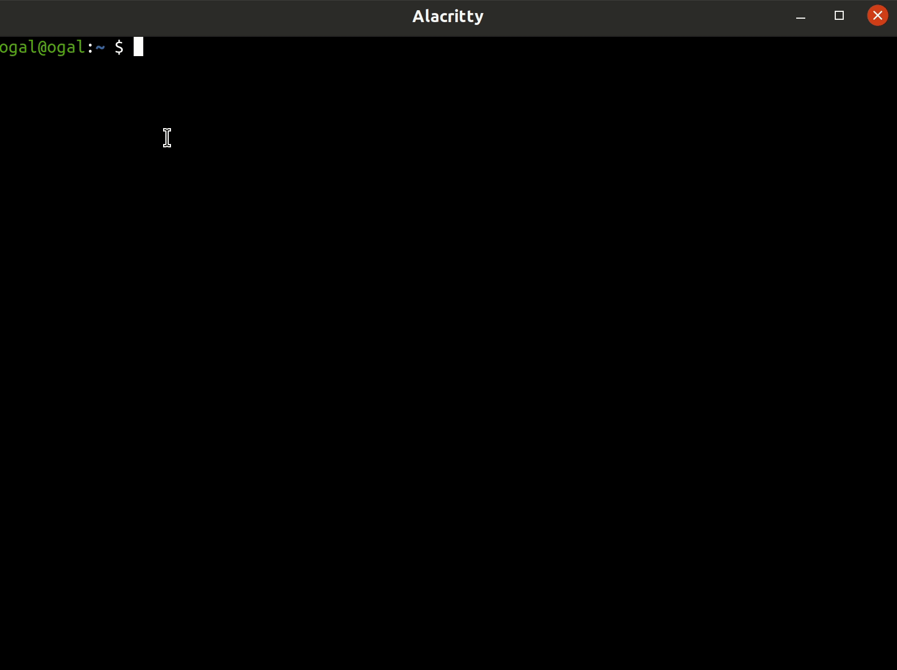

# Attach Browser Sessions to Tmux Sessions

Plugin that let you have a browser session that is attached to the tmux sessions.



## Dependencies

* Firefox/Chrome/Chromium (Tested on Firefox)
* [brotab](https://github.com/balta2ar/brotab)
* [resurrect](https://github.com/tmux-plugins/tmux-resurrect)
* wmctrl (recommended, used to jump to the window)

## Usage

Hit `prefix` + `@open_browser_key` to open a browser session (window) attached to your tmux session, when [tmux-reserruct](https://github.com/tmux-plugins/tmux-resurrect) saves your tmux sessions the web browser sessions will be saved to ` ~/.tmux/browser-sessions`.

Each session has his own web browser window which is a "web&tmux session", I recommend to always browse in `tmux-browser` session, this way your tabs will be organized per tmux session and you can always jump back to your work session in ease.

_**Note**_: The plugin identify the browser session by the "special tab", `dont_close-tmux-browser_{session_name}`.

_**Note**_: it's recommended to disable `Open previous windows and tabs` browser option


## Installation

### Installation with [Tmux Plugin Manager](https://github.com/tmux-plugins/tpm) (recommended)

Add plugin to the list of TPM plugins:

```tmux.conf
set -g @plugin 'ofirgall/tmux-browser'
```

Press prefix + I to install it.

### Manual Installation

Clone the repo:

```bash
$ git clone https://github.com/ofirgall/tmux-browser.git ~/clone/path
```

Add this line to your .tmux.conf:

```tmux.conf
run-shell ~/clone/path/tmux-browser.tmux
```

Reload TMUX environment with:

```bash
$ tmux source-file ~/.tmux.conf
```

## Configuration Options

The following configuration options are available:

### `@open_browser_key`

Key used to open the browser session. 

```tmux.conf
set -g @open_browser_key 'B'
```

### `@new_browser_window`

The command to run a new window.
E.g: `firefox --new-window url`

```tmux.conf
set -g @new_browser_window 'firefox --new-window'
```

### `@browser_session_dir`

The directory to save the sessions to.

```tmux.conf
set -g @browser_session_dir '$HOME/.tmux/browser-sessions'
```

### `@browser_wait_timeout`

Timeout value to wait for windows to open.

```tmux.conf
set -g @browser_wait_timeout '5.0'
```

### `@browser_dont_hook_to_resurrect`

Set to '1' to disable hook to resurrect (Auto saves the session). 

```tmux.conf
set -g @browser_dont_hook_to_resurrect '0'
```

### `@browser_launch_on_attach`

Set to '1' to launch restored browser on attach

```tmux.conf
set -g @browser_launch_on_attach '0'
```

### `@browser_close_on_deattach`

Set to '1' to close the attached browser on session de-attach

```tmux.conf
set -g @browser_close_on_deattach '1'
```

### `@browser_brotab_timeout`

Timeout value to wait for `bt list` (can be very slow on windows).

```tmux.conf
set -g @browser_brotab_timeout '5.0'
```

---

## TODO

Doesn't Require Custom Extensions:
* move active tab of current session to other session (+jump?)

Requires Custom Extension:
* move tabs to another session in the browser ui
* show current session
* try to get rid of the special tab
* pin the "special tab"
* prompt are you sure on special tab + some nice html
* Reset bt mediator if needed


## License

[MIT](LICENSE)
